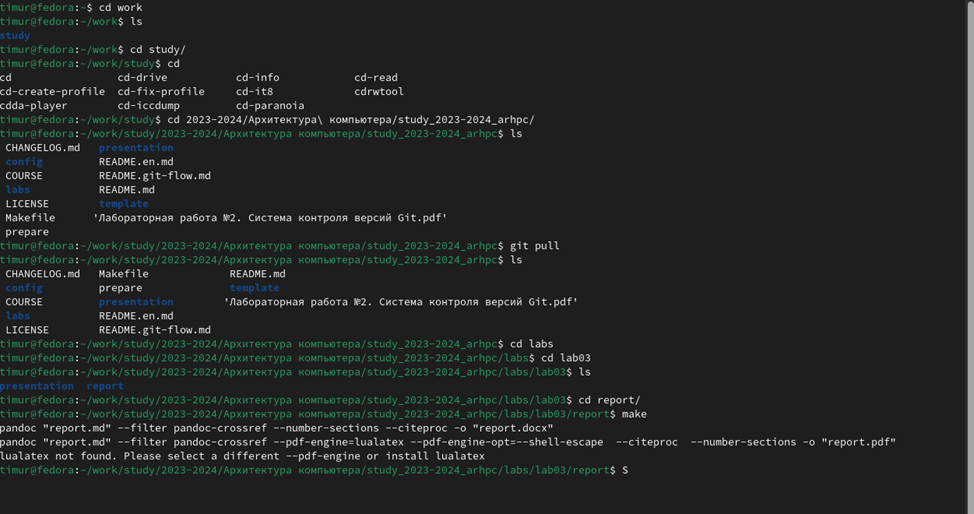

---
## Front matter
title: "Отчёт по лабораторной работе №3"
subtitle: "дисциплина: Архитектура компьютера"
author: "Ковалев Тимур Григорьевич"

## Generic otions
lang: ru-RU
toc-title: "Содержание"

## Bibliography
bibliography: bib/cite.bib
csl: pandoc/csl/gost-r-7-0-5-2008-numeric.csl

## Pdf output format
toc: true # Table of contents
toc-depth: 2
lof: true # List of figures
lot: true # List of tables
fontsize: 12pt
linestretch: 1.5
papersize: a4
documentclass: scrreprt
## I18n polyglossia
polyglossia-lang:
  name: russian
  options:
	- spelling=modern
	- babelshorthands=true
polyglossia-otherlangs:
  name: english
## I18n babel
babel-lang: russian
babel-otherlangs: english
## Fonts
mainfont: IBM Plex Serif
romanfont: IBM Plex Serif
sansfont: IBM Plex Sans
monofont: IBM Plex Mono
mathfont: STIX Two Math
mainfontoptions: Ligatures=Common,Ligatures=TeX,Scale=0.94
romanfontoptions: Ligatures=Common,Ligatures=TeX,Scale=0.94
sansfontoptions: Ligatures=Common,Ligatures=TeX,Scale=MatchLowercase,Scale=0.94
monofontoptions: Scale=MatchLowercase,Scale=0.94,FakeStretch=0.9
mathfontoptions:
## Biblatex
biblatex: true
biblio-style: "gost-numeric"
biblatexoptions:
  - parentracker=true
  - backend=biber
  - hyperref=auto
  - language=auto
  - autolang=other*
  - citestyle=gost-numeric
## Pandoc-crossref LaTeX customization
figureTitle: "Рис."
tableTitle: "Таблица"
listingTitle: "Листинг"
lofTitle: "Список иллюстраций"
lotTitle: "Список таблиц"
lolTitle: "Листинги"
## Misc options
indent: true
header-includes:
  - \usepackage{indentfirst}
  - \usepackage{float} # keep figures where there are in the text
  - \floatplacement{figure}{H} # keep figures where there are in the text
---

# Цель работы

Целью работы является освоение языка разметки MarkDown и оформление отчетов с помощью него 

# Задание

На основе методических рекомендации научиться работать с Markdown а так же выполнение следующий условий 
•Установка необходимого ПО 
•Заполнение отчета по выполнению лабораторной работы №4 с помощью языка разметки Markdown
•Задание для самостоятельной работы

# Теоретическое введение
Markdown — облегчённый язык разметки, созданный с целью обозначения форматирования в простом тексте, с максимальным сохранением его читаемости человеком, и пригодный для машинного преобразования в языки для продвинутых публикаций (HTML, Rich Text и других).

# Выполнение лабораторной работы
При выполнении лабораторной работы было установлено следующее ПО: • TeX Live (https://www.tug.org/texlive/) последней версии. • Pandoc (https://pandoc.org/)

В начале работы, переш в директорию study_2023-2024_archpc и написал команду git pull, потом перешел в директорию lab03 и прописал команду make (рис. [-@fig:001]).
{#fig:001 width=70%}
Потом было удаление файлов созданных командой make с помощью команды make clean (рис. [-@fig:002]).
.png){#fig:002 width=70%}
Далее был открыт файл report.md с помощью команды gedit (рис. [-@fig:003]).
.png){#fig:003 width=70%}
Далее с помошью редактора выполняю отчет по лабараторной работе (рис. [-@fig:004]).
.png){#fig:004 width=70%}
Так же я выполняю отчет в markdown и по второй лабораторной работе, для этого перехожу в директорию 2 лабораторной работы и готовлю отчет с помощью текстового редактора mousepad (рис. [-@fig:002]).
.png){#fig:005 width=70%}
# Выводы

В результате выполнения данной лабораторной работы я освоила процедуры оформления отчетов с помощью легковесного языка разметки Markdown.

# Список литературы{.unnumbered}

1.	Курс на ТУИС
2.	Лабораторная работа №3

